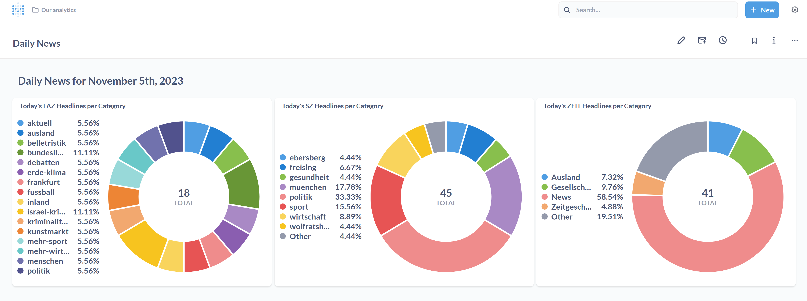
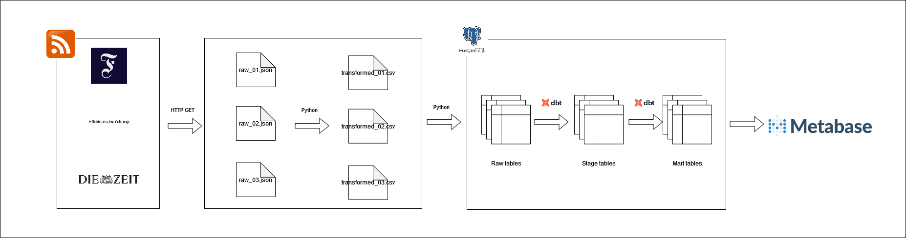

# RSS Mining - Data Engineering Sample Project

This is a sample project to showcase a simple Data Engineering task. It's goal is to help in learning new tools, i.e. dbt and Airflow, and to help beginners break into the field of Data Engineering by showing a simple project from start to finish.

## Overview

The RSS Mining project's aim is to fetch data from various RSS feeds of newspapers and aggregate them into on single database. The results show be displayed via a simple Web Dashboard, s.t. end-users can explore the data.

To achieve this, the RSS feeds of three different german newspapers (Frankfurter Allgemeine (FAZ), Süddeutsche (SZ) and Die ZEIT) are fetched via a HTTP request and saved to disk. The data is then loaded into a Postgres database, transformed via dbt and visualized using Metabase.

### Data Visualization



### Data Architecture



## Prerequisites

This project was developed using:

- Python 3.10.6
- Poetry 1.4.2
- Docker 24.0.6, build ed223bc

## How to Run This Project

1. Enter poetry shell

```bash
poetry shell
```

2. Install dependencies

```bash
poetry install

# Install dbt plugins
cd dbt_transformations
dbt deps
```

3. Start the docker containers

```bash
./up.sh
```

4. Open the Airflow Web UI (http://localhost:8080) and log in using the default credentials (User: airflow, Password: airflow)
5. Run the `init_db` DAG 
6. Run the individual DAGs for the RSS feeds
7. Run the `update-overall-mart` DAG to consilidate the data of the individual feeds in one table
8. Open Metabase (http://localhost:3000) and register your local account
9. Explore the data marts using Metabase and build your own dashboard


## Lessons Learned

The RSS mining showcase is a good project to get to know Data Engineering in a nutshell. In this small example already, one can see the challenges that arise when "moving data from A to B", using different online sources on the way. There are many tools (Python, Airflow, dbt, Postgres) that need to work together in order to set up this kind of pipeline. Also, one needs to think about cleaning data, upserting already fetched data, how to handle missing values, etc.. 

To further enhance the project, one could think about moving it to the cloud. The first things that come to mind are the usage of cloud storage (e.g. Azure Blob Storages, AWS S3) to store the RSS feeds. If one would want improve in DevOps, an Airflow deployment to a cloud Kubernetes service would also seem viable. In addition, instead of using CSV files, one could use modern "data lake" formats, such as parquet and delta lake, to store the transformed data.

## Contact

Please feel free to contact me if you have any questions at [LinkedIn](https://www.linkedin.com/in/maurice-atrops-116091210/) or directly in the repository
